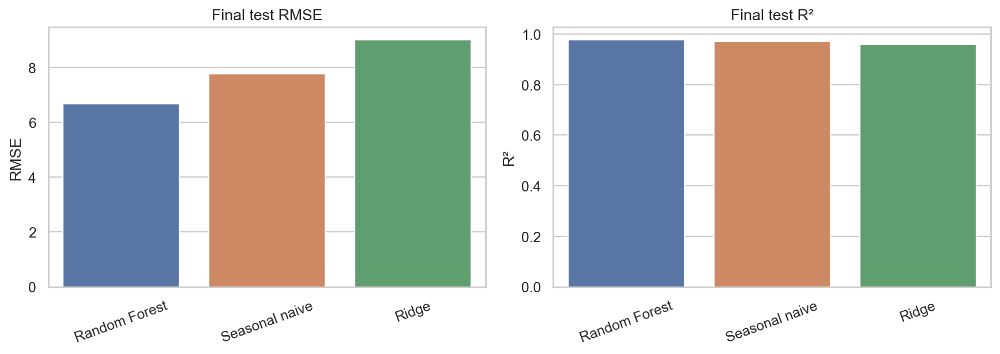

# Cross-country retail trade forecasting

[](https://colab.research.google.com/github/sagar-nautiyal-dev/Sagar_Projects/blob/main/retail-trade-forecasting/notebooks/retail_trade_forecasting.ipynb)

Monthly retail-sales indices from Australia, Great Britain, New Zealand, and the United States are modelled with leakage-safe lag features and chronological validation.

## Result

The best final-test model was **Random Forest**, with RMSE **6.678** and R² **0.977** on January 2024 through March 2025. The seasonal-naive benchmark recorded RMSE **7.751** and R² **0.969**.



## What this project demonstrates

- Reproducible cleaning and alignment of four national statistical datasets
- Panel time-series feature engineering using lagged and rolling values
- Expanding-window model selection without random temporal leakage
- Comparison of Ridge regression, Random Forest, and a seasonal-naive baseline
- Overall and per-country evaluation using R², RMSE, and MAE

## Review without running

GitHub renders the completed notebook, including its tables, charts, and outputs. Start with [`notebooks/retail_trade_forecasting.ipynb`](notebooks/retail_trade_forecasting.ipynb), then read [`TECHNICAL_REPORT.md`](TECHNICAL_REPORT.md) for a short summary.

## Run locally

```bash
git clone https://github.com/SagarNautiyalGetIt/Sagar_Projects.git
cd Sagar_Projects/retail-trade-forecasting
python -m venv .venv
```

Windows PowerShell:

```powershell
.venv\Scripts\Activate.ps1
python -m pip install -r requirements.txt
jupyter lab notebooks/retail_trade_forecasting.ipynb
```

macOS or Linux:

```bash
source .venv/bin/activate
python -m pip install -r requirements.txt
jupyter lab notebooks/retail_trade_forecasting.ipynb
```

Run all notebook cells from top to bottom. No credentials or private configuration are required.

## Run in Colab

The notebook can be opened directly in Google Colab. It contains an embedded compressed copy of the aligned public dataset, so no access token is entered into a code cell and no manual data upload is required.

## Repository contents

```text
data/                     Aligned public data and source terms
figures/                  Generated evaluation charts
notebooks/                Executed analysis notebook
results/                  Machine-readable evaluation tables
scripts/                  Privacy and notebook validation checks
TECHNICAL_REPORT.md       Short technical report
requirements.txt          Pinned Python dependencies
```

## Data and limitations

The common analysis window is January 2005 through March 2025. The source agencies, reuse terms, and transformations are documented in [`data/README.md`](data/README.md). Results are one-step-ahead predictions using observed lags; they are not causal estimates or unrestricted long-horizon forecasts. The highest country-level test RMSE was **Great Britain (10.311)**. **United States recorded a country-level R² of -0.960 despite a low RMSE of 2.199**, indicating that the model did not beat a country-mean benchmark on that comparatively low-variance slice. The overall score should not be read as uniform performance across markets.
